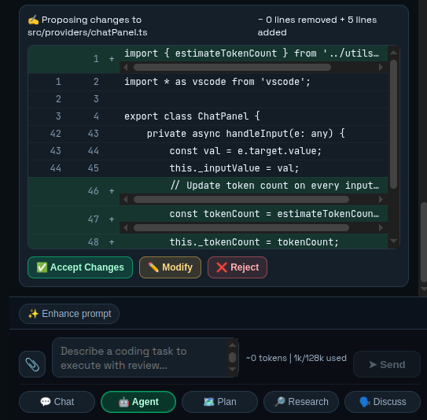
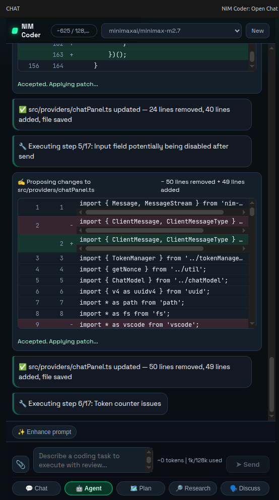

<div align="center">




# NIM Coder

### An intelligent coding agent that plans, diffs, and applies changes — with full human review at every step.

[](https://www.typescriptlang.org/)
[](https://code.visualstudio.com/)
[](https://www.minimaxi.com/)
[](LICENSE)

</div>

---

## What is NIM Coder?

NIM Coder is a VS Code–integrated AI coding agent built for engineers who want speed without losing control. Unlike autocomplete tools, NIM Coder understands your **entire codebase**, builds a structured plan, and shows you a **reviewable diff** before touching a single line — then applies it with one click.

> **Full plan → confirm → diff review → verify** — every time, no surprises.

---

## Features

- **Smart file discovery** — searches only your source files, never `venv/`, `node_modules/`, or build artifacts
- **Complexity-aware planning** — simple tasks execute instantly; complex refactors get a full step-by-step plan
- **Inline diff viewer** — colored line-by-line diff with accept, modify, or reject per file
- **Parallel execution** — all diffs generated simultaneously, accepted independently
- **Sticky status bar** — always shows what the agent is doing, even mid-scroll
- **Multi-file context tracking** — keeps full conversation and file state across operations
- **Terminal integration** — runs shell commands inline, streams output in real time
- **Token-aware** — live context usage display so you never hit limits unexpectedly

---

## Demo

### Proposing a targeted code change

NIM Coder locates the exact lines to change, generates a clean diff, and waits for your approval before writing anything to disk.



> **0 lines removed · 5 lines added** — the agent shows the line count up front so you know the scope before reading the diff.

---

### Multi-step agent execution

For larger tasks, NIM Coder runs a numbered execution plan, applies each patch after acceptance, and confirms every file saved.



> Each step shows its status live — `✅ src/providers/chatPanel.ts updated — 24 lines removed, 40 lines added, file saved` — so you always know where you are in the process.

---

## How it works

```
You type a task
      │
      ▼
 Classify complexity
  ┌───┴────────────┐
  │ Simple task    │  Complex task
  │ (e.g. remove  │  (e.g. refactor
  │  a class)     │   a module)
  └───┬────────────┘
      │                    │
      ▼                    ▼
 Grep source files    Show plan →
 Find exact lines     Confirm →
      │                    │
      └─────────┬──────────┘
                ▼
        Generate diffs
        (all files in parallel)
                │
                ▼
        Show diff cards
        [Accept] [Modify] [Reject]
                │
                ▼
        Apply patches + confirm
                │
                ▼
        Run tests / verify
```

---

## Installation

```bash
# Clone the repo
git clone https://github.com/talha307841/free-coding-agent.git
cd free-coding-agent

# Install dependencies
npm install

# Build the extension
npm run build

# Open in VS Code
code .
# Then press F5 to launch the extension host
```

Or install from the VS Code Marketplace *(coming soon)*.

---

## Website

The production landing page is in `nim-coder/`.

Live website: https://free-coding-agent.vercel.app/

```bash
# Run the website locally
npm run dev

# Install Vercel CLI
npm i -g vercel

# Deploy
cd nim-coder
vercel

# Or connect GitHub repo to vercel.com for auto-deploy on push
```

---

## Usage

1. Open a project folder in VS Code
2. Open NIM Coder from the sidebar (`Ctrl+Shift+N`)
3. Select **Agent** mode from the tab bar
4. Type your task in plain English:

```
remove the scraping bee backend from main.py
refactor the auth module to use JWT
add error handling to all API calls in routes/
```

NIM Coder will find the relevant files, propose changes, and wait for your review.

---

## Modes

| Mode | What it does |
|------|-------------|
| **Chat** | Ask questions about your code, get explanations |
| **Agent** | Full plan → execute → diff → apply workflow |
| **Plan** | Review and edit the agent's plan before execution |
| **Research** | Deep-dive into a topic across your codebase |
| **Discuss** | Conversational code review and architecture discussion |

---

## Configuration

```jsonc
// .vscode/settings.json
{
  "nimCoder.model": "minimaxai/minimax-m2.7",
  "nimCoder.maxContextTokens": 128000,
  "nimCoder.excludeDirs": ["venv", ".venv", "node_modules", "dist", "build"],
  "nimCoder.autoApproveSimpleTasks": false,
  "nimCoder.parallelDiffGeneration": true
}
```

---

## Architecture

```
free-coding-agent/
├── src/
│   ├── extension.ts               # VS Code extension entry point
│   ├── config.ts                  # Extension settings and defaults
│   ├── contextBuilder.ts          # Workspace context retrieval
│   ├── nimClient.ts               # NVIDIA NIM client wrapper
│   ├── modelRouter.ts             # Model routing and fallback
│   ├── commands/                  # Slash/command handlers
│   ├── providers/
│   │   ├── chatPanel.ts           # Main chat + agent workflow provider
│   │   ├── agentRunner.ts
│   │   ├── diagnosticFixer.ts
│   │   └── inlineCompletion.ts
│   ├── utils/
│   │   ├── diffApplier.ts         # Unified diff parsing/application
│   │   ├── fileScanner.ts
│   │   ├── streamParser.ts
│   │   └── tokenCounter.ts
│   ├── workflow/
│   │   └── stateMachine.ts
│   └── webview/
│       └── chatPanel.html         # Webview UI
├── media/
│   ├── agent-diff-proposal.png
│   └── agent-step-execution.png
└── package.json
```

---

## Roadmap

- [ ] Multi-model support (GPT-4o, Claude, Gemini)
- [ ] Git integration — auto-commit accepted changes with generated messages
- [ ] Test runner integration — automatically run tests after applying patches
- [ ] Workspace memory — remember context across sessions
- [ ] Team sync — share agent sessions with teammates
- [ ] CLI mode — run NIM Coder from the terminal without VS Code

---

## Contributing

Pull requests are welcome. For major changes, open an issue first to discuss what you'd like to change.

```bash
# Run tests
npm test

# Lint
npm run lint

# Build for production
npm run package
```

---

## License

MIT © NIM Coder Contributors

---

<div align="center">

Built for developers who want AI that asks before it acts.

**[Report a Bug](https://github.com/talha307841/free-coding-agent/issues)** · **[Request a Feature](https://github.com/talha307841/free-coding-agent/issues)** · **[Documentation](https://github.com/talha307841/free-coding-agent#readme)**

</div>